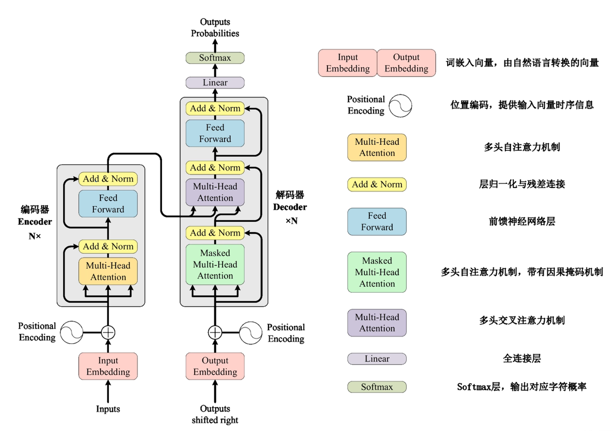

# Transformer

## 整体结构

## 词嵌入(Token Embedding)
一个Token会被转换成一个向量，就是词嵌入。我们通过构造一个词嵌入矩阵来实现这个功能。这个矩阵的行数等于词汇表的大小，列数等于词嵌入的维度。每一行对应一个Token的词嵌入向量。

对于输入序列中的每个Token，我们用一个独热向量来表示它在词汇表中的位置。这个独热向量与词嵌入矩阵相乘，就得到了该Token的词嵌入向量。但实际中我们通常不进行相乘而是直接使用索引来获取词嵌入向量。

## 位置编码(Positional Encoding)
我们之后学习自注意力会发现，它本身不关心位置信息，因此我们需要将位置信息显式的加入到输入序列中。我们采用三角函数有多种优势：它们是连续的、周期性的，并且在不同频率上具有不同的相位，这使得模型能够捕捉到不同位置之间的关系。

公式如下：
$$
PE(pos, 2i) = \sin\left(\frac{pos}{10000^{2i/d_{model}}}\right)\\
PE(pos, 2i+1) = \cos\left(\frac{pos}{10000^{2i/d_{model}}}\right)
$$
然后我们将词嵌入向量和位置编码相加，得到输入序列中每个Token的最终表示。

## 自注意力机制(Self-Attention)
多头自注意力机制、带有掩码的自注意力机制和多头交叉注意力机制都是自注意力机制的变体。

