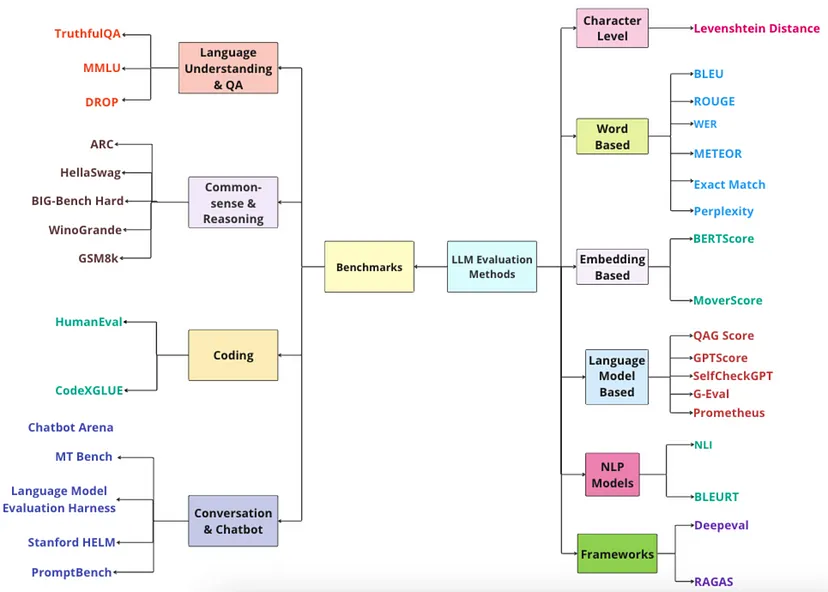

# 如何评估模型

## 基准测试(Benchmarking)
优势：
1. 便于比较：基准测试提供了一个标准化的评估框架，使得不同模型之间的性能比较变得更加容易和公平。
2. 量化结果：基准测试通常提供定量的性能指标，如准确率、召回率、F1分数等，这些指标可以帮助我们更好地理解模型的表现。

基准测试是一组标准化测试，不同的基准测试

## 常用的评估指标
1. 词错误率（WER）：是一类基于WER的指标，用于计算编辑距离 d(c,r) ，即将候选文本转换为参考文本所需的最小编辑操作数（插入、删除、替换）。
2. 精确匹配：通过将生成的文本与参考文本进行匹配来衡量候选文本的准确性。与参考文本之间的任何错误都会被视为错误。只适用于抽取式与短格式答案的情况，因为这种情况下期望生成的文本与参考文本完全匹配。
3. 困惑度（PPL）：是语言模型评估的常用指标，衡量模型对测试数据的预测能力。PPPL越低，表示模型对测试数据的预测能力越强。一般适用于经典语言模型，对BERT这样的掩码语言不使用。
