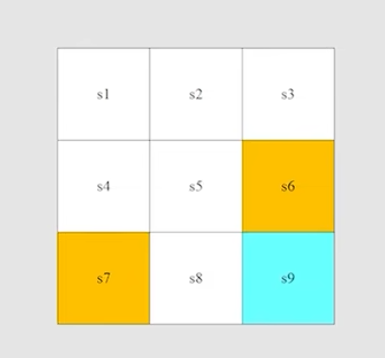
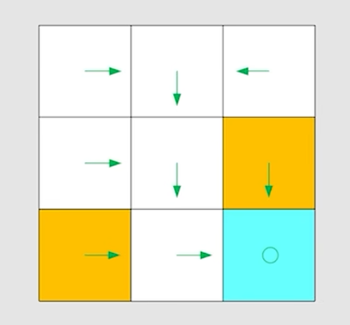
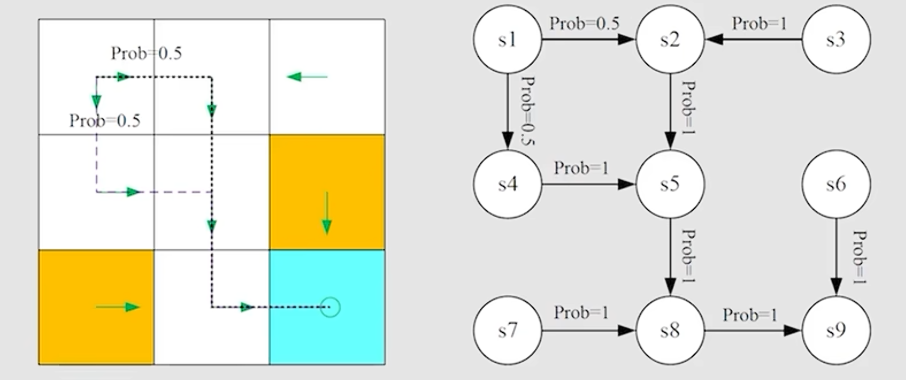

# ch1 Basic Concepts
> 参考: [【强化学习的数学原理】课程：从零开始到透彻理解（完结）](https://www.bilibili.com/video/BV1sd4y167NS/)

## part1: state, action, policy...
接下来的讲解都是基于 grid-world 的例子来进行的，grid-world 是一个 $5\times 5$ 的网格，agent 可以在这个网格中进行移动。

在这个图中，白色是可以移动的区域，橙色是 forbidden 的区域，蓝色是 target 区域，agent 的目标是从起始位置移动到 target 区域。

**state** : the status of agent with respect to the environment.

- For the grid-world example, the location of the agent in the grid is the state.

**state space** : the set of all states $S = \{s_i\}$

**action** : for each state, there are five possible actions: up, down, left, right, and stay in this example.

**action space** : the set of all actions $\mathcal{A}(s_i) = \{a_{i1}, a_{i2}, a_{i3}, a_{i4}, a_{i5}\}$, 值得注意的是 action 是依赖于 state 的，这里的 $\mathcal{A}(s_i)$ 实际上表示 $A$ 是 $s_i$ 的一个函数，只不过在这个例子中，每个 state 的 action space 都是一样的。

**state transition** : when taking an action $a_{ij}$ in state $s_i$, the agent may move from a state to another state $s_j$. This is called a *state transition*, which can be denoted as $s_i \xrightarrow{a_{ij}} s_j$. state transition 实际上是定义了 agent 与环境的一个交互的行为

**tabular representation** : 由于 state space 和 action space 都是 deterministic 的，所以我们可以用一个表格来表示 state transition 的情况. 学过离散数学和编译原理的感觉可以理解为自动机的状态转移图。

更一般的方式是使用 **state transition probability** : use probability to describe state transition
- intuition: at state $s_1$, 如果采用 action $a_{11}$，我们会到达 state $s_2$
- math: 
$$
P(s_2|s_1, a_{11})=1\\
P(s_i|s_1, a_{11})=0, \forall i\neq 2
$$
这里是一个 deterministic case, 这样的 state transition 也可以描述 stochastic 的情况

**policy** : tells the agent how to take action in each state.
- intuition representation: use arrows to represent the policy.

基于 policy , 我们可以得到 path or trajectory.

- mathematical representation: 例如针对 $s_1$
$$
\pi(a_{12}|s_1) = 1\\
\pi(a_{1i}|s_1) = 0, \forall i\neq 2
$$
在 RL 中 $\pi$ 统一指的是 policy, 它指定了任何一个 state 下任何一个 action 的概率分布，是一个条件概率, 有些时候对于某些等于 0 的情况，可能会被省略，但其实它们都是有的，只不过都是 0.

## part2: reward, return, markov decision process...

**reward** : reward 是一个 scalar signal, a real number we get after taking an action.
- 一个 positive reward 表示我们鼓励 agent 去做这个 action
- 一个 negative reward 表示我们惩罚 agent 去做这个 action

reward 实际上可以被理解为一种 human-machine interaction interface, 通过引导 agent 去做一些我们想要它去做的事情，来达到我们想要的结果。

mathematical representation: 
- intuition: 在 $s_1$ ，如果我们采用 $a_11$, 那么 reward 是 -1
- math:
$$
P(r=-1|s_1, a_{11})=1\\
P(r\neq -1|s_1, a_{11})=0
$$

**trajectory(轨迹)** : a sequence of states, actions and rewards. 例如 $s_1 \xrightarrow[r_1]{a_{11}} s_2 \xrightarrow[r_2]{a_{21}} s_3$ 以及对应的 reward sequence $r_1, r_2$.

The **return(回报)** of this trajectory is the total reward we get from this trajectory, which can be denoted as $R = r_1 + r_2$.

return 可以用来评估一个 policy 的好坏。

**discount factor(折扣因子)** : a trajectory 可能会是无穷长的，例如：
$$
s_1 \xrightarrow[r_1]{a_{12}} s_2 \xrightarrow[r_2]{a_{23}} s_5 \xrightarrow[r_3]{a_{53}} s_8 \xrightarrow[r_4]{a_{82}} s_9 \xrightarrow[r_5]{a_{95}} s_{9} \xrightarrow[r_5]{a_{95}} ...
$$
这个时候的 return 就是无穷大的，发散的。

因此我们通过引入 $\gamma \in [0,1)$ 来对 return 进行折扣，得到 discounted return:
$$
\text{discount return} = 0+0\cdot \gamma + 0\cdot \gamma^2 + 1 \cdot \gamma^3 + 1 \cdot \gamma^4 + 1 \cdot \gamma^5 + ...\\
= \gamma^3 (1+\gamma + \gamma^2 + ...)\\
= \frac{\gamma^3}{1-\gamma}
$$
- 如果 $\gamma$ 趋近于 0, 那么我们就只关注 immediate reward, 也就是短视的。
- 如果 $\gamma$ 趋近于 1, 那么我们就关注 long-term reward, 也就是远视的。

**episode(回合/试次)** : when interacting with the environment following a policy, the agent may stop at some *terminal state(终止状态)*. The resulting trajectory is called an episode (or a trial).

通常一个 episode 是有限步数的，这样的任务也被成为 episodic tasks, 例如在 grid-world 中，agent 从起始位置出发，最终到达 target 区域，这个过程就是一个 episode.

有些任务是没有 terminal state 的，这样的任务被称为 continuing tasks, 这样的任务中，agent 会一直与环境进行交互（时间比较长的话有些时候我们会近似的将其称为 continuing tasks）。

例如在 grid-world 中，我们应该让 agent 到达 target 就停止，还是让其继续执行任务就像刚刚的无限循环一样？

In fact, we can treat episodic tasks as continuing tasks in a unified mathematical way by converting episodic tasks to continuing tasks.
- Option 1: 将 target state 视为一种 absorbing state(吸收态), 一旦进入该状态，就无法离开，只能停留在该状态, 并且在该状态下的 reward 是 0.
- Option 2: 将 target state 视为一种 normal state, 如果策略好的话可以一直留在那里，如果不好还可以离开, 这样的话就不会区别对待了, 训练的时候可能会消耗更多资源，但是也会更加一般化.

### Markov Decision Process (MDP) :
接下来会用比较正式的方式重新介绍刚刚的所有概念:

key elements of an MDP:
- Sets:
  - State: the set of states $S$.
  - Action: the set of actions $\mathcal{A}(s)$ is associated for the state $s\in S$.
  - Reward: the set of rewards $\mathcal{R}(s, a)$.
- Probability distributions:
  - State transition probability: at state $s$, taking action $a$, the probability to transition to state $s'$ is denoted as $p(s'|s, a)$.
  - Reward probability: at state $s$, taking action $a$, the probability to get reward $r$ is denoted as $p(r|s, a)$.
- Policy: at state $s$, the probability to take action $a$ is denoted as $\pi(a|s)$.
- Markov property: memoryless property(无记忆性)
$$
p(s_{t+1}|s_t, a_t, s_{t-1}, a_{t-1}, ..., s_0, a_0) = p(s_{t+1}|s_t, a_t)\\
p(r_{t+1}|s_t, a_t, s_{t-1}, a_{t-1}, ..., s_0, a_0) = p(r_{t+1}|s_t, a_t)
$$
这里的 Markov 指的是 Markov property; Decision 指的就是 Policy; Process 指的就是 Sets 和 Probability distributions.

grid-world 可以被抽象成一个更加 general 的模型, Markov process.

Markov Decision Process becomes Markov Process once the policy is given. 也就是说一旦 MDP 中的 policy 被确定了, 那么这个 policy 就与系统融为一体了, 那么它就变成了一个 Markov Process.

## Summary
- state
- action
- State transition, state transition probability $p(s'|s, a)$
- reward, reward probability $p(r|s, a)$
- trajectory, return, discount factor $\gamma$
- Markov Decision Process (MDP) and Markov Process
