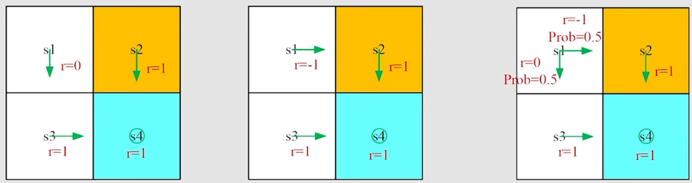
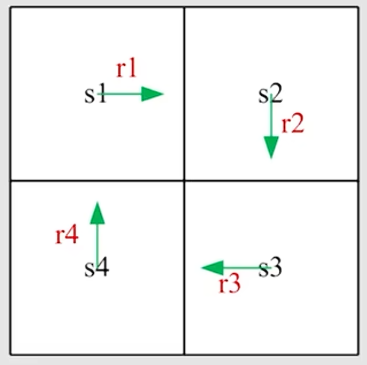
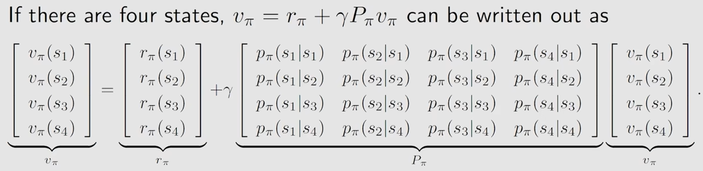

# ch2 Bellman Equation
> 参考: [【强化学习的数学原理】课程：从零开始到透彻理解（完结）](https://www.bilibili.com/video/BV1sd4y167NS/)

> 这一节, 会学习一个核心概念: state value;
> 以及一个基础工具: Bellman equation.

## part1: Movtivaing example - why is return important?
为什么 return 很重要, 因为 return 可以用来评估一个 policy 的好坏, 以及指导我们去改进 policy.

例如下面的三种不同的 policy

我们分别计算一下:
$$
\text{return}_1 = 0+\gamma+\gamma^2+...=\frac{\gamma}{1-\gamma}\\
\text{return}_2 = -1+\gamma+\gamma^2+...=-1+\frac{\gamma}{1-\gamma}\\
\text{return}_3 = 0.5\cdot \frac{\gamma}{1-\gamma}+0.5\cdot (-1+\frac{\gamma}{1-\gamma})=\frac{\gamma}{1-\gamma}-0.5
$$
这里的 $\text{return}_3$ 严格上说已经不是 return 了，因为 return 评估的是一个 trajectory, 这里的 $\text{return}_3$ 其实更像是 state value.

接下来看下面这个例子:

对于这个例子，我们尝试计算一下每个 state 的 return, 我们这里用 $v_i$ 表示从 state $s_i$ 开始的 return, 那么我们可以得到:
$$
v_1 = r_1 + \gamma r_2 + \gamma^2 r_3 + ... = r_1 + \gamma v_2\\
v_2 = r_2 + \gamma r_3 + \gamma^2 r_4 + ... = r_2 + \gamma v_3\\
v_3 = r_3 + \gamma r_4 + \gamma^2 r_1 + ... = r_3 + \gamma v_4\\
v_4 = r_4 + \gamma r_1 + \gamma^2 r_2 + ... = r_4 + \gamma v_1\\
$$
这就表明了 return 依赖于其他状态下的 return, 这也是 bootstrapping.

我们将刚刚的公式写成 matrix-vector 的形式:
$$
\begin{bmatrix}v_1\\
v_2\\
v_3\\
v_4\end{bmatrix} = \begin{bmatrix}r_1\\
r_2\\
r_3\\
r_4\end{bmatrix} + \gamma \begin{bmatrix}0 & 1 & 0 & 0\\
0 & 0 & 1 & 0\\
0 & 0 & 0 & 1\\
1 & 0 & 0 & 0\end{bmatrix} \begin{bmatrix}v_1\\
v_2\\
v_3\\
v_4\end{bmatrix}
$$
整理一下可以得到:
$$
\mathbf{v} = \mathbf{r} + \gamma \mathbf{P} \mathbf{v}
$$
这就是 Bellman equation 的 matrix-vector 形式(这只是一个非常简单的例子)

## part2: State value
考虑下面的单步过程:
$$
S_t \xrightarrow{A_t} R_{t+1}, S_{t+1}
$$
- t, t+1: time step
- $S_t$: state at time step t
- $A_t$: the action taken at state $S_t$
- $R_{t+1}$: the reward we get after taking action $A_t$ at state $S_t$(有些时候这里也会写作 $R_{t+1}$ , 当然这在数学上是无所谓的)
- $S_{t+1}$: the next state we transition to after taking action $A_t$ at state $S_t$
注意这里的符号都是大写的, 代表它们都是随机变量, 这意味着我们可以对其求一系列的操作, 例如求期望, 求概率等等.

另外这里的这些都是由 probability distribution 来描述的, 这里就先省略了。

现在考虑一个多步的过程:
$$
S_t \xrightarrow{A_t} R_{t+1}, S_{t+1} \xrightarrow{A_{t+1}} R_{t+2}, S_{t+2} \xrightarrow{A_{t+2}} R_{t+3}, S_{t+3} ...
$$
对于这个 trajectory, 我们可以定义它的 return:
$$
G_t = R_{t+1} + \gamma R_{t+2} + \gamma^2 R_{t+3} + ...
$$
可以注意到 $G_t$ 也是一个随机变量

之后，我们可以考虑定义 state value:

The expection (or called expected value or mean) of $G_t$ is defined as the state value function or simply state value:
$$
\mathit{v}_{\pi}(s) = \mathbb{E}_{\pi}[G_t|S_t=s]
$$
我们可以注意到以下几点:
- 它是一个关于 state 的函数, 是从 state 出发的 return 的期望, 因此它是一个 state value.
- 它是基于 policy $\pi$ 的, 因此它是一个 policy dependent 的 state value.
- 它反应了一个 state 的 value, 这个 value 越大, 就说明它越有价值.

## part3: Bellman equation - Derivation
bellman equation 实际上就是描述了不同 state 之间的 value 的关系, 以及 value 和 reward 之间的关系.

考虑一个多步的过程:
$$
S_t \xrightarrow{A_t} R_{t+1}, S_{t+1} \xrightarrow{A_{t+1}} R_{t+2}, S_{t+2} \xrightarrow{A_{t+2}} R_{t+3}, S_{t+3} ...
$$
我们可以将 $G_T$ 写成下面的形式:
$$
G_t = R_{t+1} + \gamma R_{t+2} + \gamma^2 R_{t+3} + ...\\
= R_{t+1} + \gamma (R_{t+2} + \gamma R_{t+3} + ...)\\
= R_{t+1} + \gamma G_{t+1}
$$
所以，根据 state value 的定义, 我们可以得到:
$$
\mathit{v}_{\pi}(s) = \mathbb{E}_{\pi}[G_t|S_t=s]\\
=\mathbb{E}_{\pi}[R_{t+1} + \gamma G_{t+1}|S_t=s]\\
=\mathbb{E}_{\pi}[R_{t+1}|S_t=s] +\mathbb{E}_{\pi}[\gamma \mathit{v}_{\pi}(S_{t+1})|S_t=s]
$$
首先，我们计算第一项 $\mathbb{E}_{\pi}[R_{t+1}|S_t=s]$: 
$$
\mathbb{E}_{\pi}[R_{t+1}|S_t=s] = \sum_{a}\pi(a|s)\mathbb{E}[R_{t+1}|S_t=s, A_t=a]\\
=\sum_{a}\pi(a|s)\sum_{r}p(r|s,a)r
$$
这实际上就是 immidiate rewards 的 mean

接下来看第二项 $\mathbb{E}[G_{t+1}|S_{t} = s]$:
$$
\mathbb{E}[G_{t+1}|S_{t}=s]=\sum_{s^{'}}\mathbb{E}[G_{t+1}|S_{t}=s, S_{t+1}=s^{'}]p(s^{'}|s)\\
=\sum_{s^{'}}\mathbb{E}[G_{t+1}|S_{t+1}=s^{'}]p(s^{'}|s)\\
=\sum_{s^{'}}\mathit{v}_{\pi}(s^{'})p(s^{'}|s)\\
=\sum_{s^{'}}\mathit{v}_{\pi}(s^{'})\sum_{a}p(s^{'}|s,a)\pi(a|s)
$$
这实际上是 future rewards 的 mean

推导中的第二行是基于 Markov property 的, 因为根据 Markov property, $S_{t+1}$ 已经包含了 $S_t$ 的所有信息了, 因此我们可以直接将条件概率中的 $S_t$ 去掉.

于是:
$$
\textcolor{red}{\mathit{v}_{\pi}(s)}=
\mathbb{E}_{\pi}[R_{t+1}|S_t=s]+ 
\mathbb{E}_{\pi}[\gamma \mathit{v}_{\pi}(S_{t+1})|S_t=s]\\
=\textcolor{green}{\sum_{a}\pi(a|s)\sum_{r}p(r|s,a)r +
\gamma\sum_{a}\pi(a|s)\sum_{s^{'}}p(s^{'}|s,a)}\textcolor{red}{\mathit{v}_{\pi}(s^{'})}\\
=\sum_{a}\pi(a|s)\left[\sum_{r}p(r|s,a)r +
\sum_{s^{'}}p(s^{'}|s,a)\mathit{v}_{\pi}(s^{'})\right],
\forall s \in \mathcal{S}
$$
这就是 Bellman equation 的一般形式, 这个方程描述了 state value 和 reward 以及其他 state value 之间的关系.

实际上这个式子只是看上去比较复杂, 里面其实都是贝叶斯与全概率的计算, 看上去复杂是因为里面的符号比较多, 仔细观察应该是可以理解的.

我们可以注意到 bellman equations 是依赖于 policy $\pi$ 的, 如果我们将 $\pi(a|s)$ 计算出来, 我们做的事情就是 policy evaluation, 也就是评估一个 policy 的好坏.

而这里的 $p(r|s,a)$ 和 $p(s'|s,a)$ 就是 dynamics model (or environment model), 如果我们知道了 dynamics model, 那么我们就可以通过 bellman equation 来计算 state value, 这就是 model-based policy evaluation.

如果我们不知道 dynamics model, 那么我们就只能通过采样来估计 state value, 这就是后面会讲的 model-free policy evaluation.

具体计算的例子可以参考视频 [贝尔曼公式的推导](https://www.bilibili.com/video/BV1sd4y167NS?p=6)

## part4: Bellman equation - Matrix-vertor form and solution
我们注意到 Bellman equation 的一般形式是:
$$
\mathit{v}_{\pi}(s)=\sum_{a}\pi(a|s)\left[\sum_{r}p(r|s,a)r +
\sum_{s^{'}}p(s^{'}|s,a)\mathit{v}_{\pi}(s^{'})\right], \forall s \in \mathcal{S}
$$
注意到这样的式子是对所有 state 都成立的, 因此我们可以得到若干线性方程, 这些线性方程的解就是 state value.

我们可以将其写成 matrix-vector 的形式, 首先我们先根据上述式子变形一下:
$$
\mathit{v}_{\pi}(s)=
\sum_{a}\pi(a|s)\sum_{r}p(r|s,a)r +
\sum_{a}\pi(a|s)\sum_{s^{'}}p(s^{'}|s,a)\mathit{v}_{\pi}(s^{'})\\
=r_{\pi}(s)+\sum_{s^{'}}p_{\pi}(s^{'}|s)\mathit{v}_{\pi}(s^{'})
$$
其中 $r_{\pi}(s) = \sum_{a}\pi(a|s)\sum_{r}p(r|s,a)r$ 和 $p_{\pi}(s'|s) = \sum_{a}\pi(a|s)p(s'|s,a)$, 之后我们就可以将上面的式子写成下面的形式:
$$
\mathbf{v} = \mathbf{r} + \gamma \mathbf{P} \mathbf{v}
$$
其中
- $\mathbf{v}$ 是 state value 的向量表示
- $\mathbf{r}$ 是 reward 的向量表示
- $\mathbf{P}$ 是 transition probability 的矩阵表示
- $\gamma$ 是 discount factor

我们可以举一个具体的例子看一下:

## solve state value
给定一个 policy $\pi$ 找到相应的 state value $\mathbf{v}$ , 叫做 policy evaluation, 也就是评估一个 policy 的好坏.

我们可以得到 bellman equation 的闭式解:
$$
\mathbf{v} = (\mathbf{I} - \gamma \mathbf{P})^{-1} \mathbf{r}
$$
但是实际上这个解并不适用, 因为它要求我们必须知道 $\mathbf{P}$ 和 $\mathbf{r}$, 同时时间复杂度也是 $O(|\mathcal{S}|^3)$, 因此在实际中我们并不使用这个解.

我们可以使用迭代的方法来求解 state value, 这个方法叫做 value iteration:
$$
\mathbf{v}_{k+1} = \mathbf{r} + \gamma \mathbf{P} \mathbf{v}_k
$$
可以证明这个迭代方法是收敛的, 也就是说当 $k \to \infty$ 时, $\mathbf{v}_k \to \mathbf{v}$, 这个证明可以参考视频 [公式-向量形式与求解](https://www.bilibili.com/video/BV1sd4y167NS?p=7)

## part5: Action value
- state value 是从 state 出发的 return 的期望
- action value 是从 state 出发, 采取 action 后的 return 的期望

Q: 为什么我们要关注 action value 呢?
A: 因为我们要知道哪些 action 更好, action value 可以指导我们去选择更好的 action.

action value 的定义如下:
$$
\mathit{q}_{\pi}(s,a) = \mathbb{E}_{\pi}[G_t|S_t=s, A_t=a]
$$
q 应该指的是 quality.

可以注意到:
$$
\mathit{v}_{\pi}(s) = \sum_{a}\pi(a|s)\mathit{q}_{\pi}(s,a)
$$
因此我们对比一下 state value 和 action value 的定义可以得到 action value 的表达式:
$$
\mathit{q}_{\pi}(s,a) = 
\sum_{r}p(r|s,a)r + \gamma\sum_{s^{'}}p(s^{'}|s,a)\mathit{v}_{\pi}(s^{'}), \forall s \in \mathcal{S}, a \in \mathcal{A}
$$
值得注意的是, 虽然 policy 中不一定有这个 action, 但是我们也可以计算这个 action 的 action value, 这也是为什么 action value 是一个 state-action pair 的函数的原因.

另外，我们也可以不计算 state value, 直接计算 action value, 这也是后面会讲的 model-free policy evaluation 的方法.

## summary
- state value: $\mathit{v}_{\pi}(s) = \mathbb{E}_{\pi}[G_t|S_t=s]$
- action value: $\mathit{q}_{\pi}(s,a) = \mathbb{E}_{\pi}[G_t|S_t=s, A_t=a]$
- bellman equation (element-wise form):
$$
\mathit{v}_{\pi}(s)=\sum_{a}\pi(a|s)\left[\sum_{r}p(r|s,a)r +
\sum_{s^{'}}p(s^{'}|s,a)\mathit{v}_{\pi}(s^{'})\right]\\
= \sum_{a}\pi(a|s)\mathit{q}_{\pi}(s,a), \forall s \in \mathcal{S}
$$
- bellman equation (matrix-vector form):
$$
\mathbf{v}_{\pi} = \mathbf{r}_{\pi} + \gamma \mathbf{P}_{\pi} \mathbf{v}_{\pi}
$$
- 如何求解 bellman equation: 闭式解与迭代解
