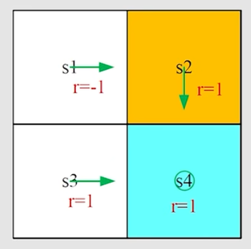

# ch3 Bellman Optimality Equation
> 参考: [【强化学习的数学原理】课程：从零开始到透彻理解（完结）](https://www.bilibili.com/video/BV1sd4y167NS/)

> 核心概念: optimal state value, optimal policy;
>
> 一个基础工具: Bellman optimality equation(BOE).

## part1: how to improve a policy

### Motivating example
考虑下面的例子:

我们可以计算出state $s_1$ 的每一个 action value(我们假设 $\gamma=0.9$):
$$
\mathit{q}_{\pi}(s_1,a_1) = -1 + \gamma \cdot \mathit{v}_{\pi}(s_1) = 6.2\\
\mathit{q}_{\pi}(s_1,a_2) = -1 + \gamma \cdot \mathit{v}_{\pi}(s_2) = 8\\
\mathit{q}_{\pi}(s_1,a_3) = 0 + \gamma \cdot \mathit{v}_{\pi}(s_3) = 9\\
\mathit{q}_{\pi}(s_1,a_4) = -1 + \gamma \cdot \mathit{v}_{\pi}(s_1) = 6.2\\
\mathit{q}_{\pi}(s_1,a_5) = 0 + \gamma \cdot \mathit{v}_{\pi}(s_1) = 7.2
$$
我们可以注意到这里 $a_3$ 是最优的动作, 因此我们可以通过改进 policy 来让 $s_1$ 选择 $a_3$ 来提高 policy.

具体而言就是 
$$
\pi_{\text{new}}(a|s_1) = \begin{cases}
1, & \text{if } a = a^{*}\\
0, & \text{otherwise}
\end{cases}\\
\text{where  } a^{*} = \arg\max_{a} \mathit{q}_{\pi}(s_1,a) = a_3
$$
在这个例子中除了 $s_1$ 以外的其他 state 的 action 已经是最优的了, 但即使其余的 state 的 action 不是最优的, 只有我们不断对所有 state 进行 policy improvement, 最终我们也能得到一个 optimal policy.

为了从数学上理解这个过程, 我们需要借助数学工具来分析 policy improvement 的过程, 这就是 Bellman optimality equation.

## part2: Optimal policy and Bellman optimality equation
### definition of optimal policy
if:
$$
\mathit{v}_{\pi_1}(s) \geq \mathit{v}_{\pi_2}(s), \forall s \in \mathcal{S}
$$
then $\pi_1$ is said to be better than or equal to $\pi_2$.

这个定义出来之后, 我们需要回答一系列问题:

$Q_1$: 这个 optimal policy 存在吗?

$Q_2$: 这个 optimal policy 是唯一的吗?

$Q_3$: 这个 optimal policy 是 stochastic 还是 deterministic 的?

$Q_4$: 我们要怎么得到这个 optimal policy?

为了回答这些问题, 我们需要引入 Bellman optimality equation.
### Bellman optimality equation(BOE): introduction
对于 elementwise form 的 BOE, 我们有:
$$
\mathit{v}(s) = \max_{\pi} \sum_{a}\pi(a|s)\left( \sum_{r}p(r|s, a)r + \gamma\sum_{s^{'}}p(s^{'}|s, a)\mathit{v}(s^{'})\right)\\
=\max_{\pi}\sum_{a}\pi(a|s)\mathit{q}(s, a), s \in \mathcal{S}
$$
注意到这与 bellman 公式之间的区别在于, $\pi$ 是没有被给定的, 我们需要去求解这样的一个 $\pi$.

matrix-vector form 的 BOE 是:
$$
\mathbf{v} = \max_{\pi} \left( \mathbf{r}_{\pi} + \gamma \mathbf{P}_{\pi} \mathbf{v} \right)
$$
这个等式我们需要去研究它的几个问题:
- Algorithm: 怎么去求解这个等式?
- Existence: 这个等式的解存在吗?
- Uniqueness: 这个等式的解唯一吗?
- Optimality: 这个等式与 optimal policy 之间的关系是什么?

### BOE: Maximization on the right hand side
对于 BOE , 我们实际上要求两个未知量, 一个是 $\pi$, 另一个是 $\mathit{v}$, 那么我们先着手分析一下最优的问题:

考虑下面的一个简单的式子:
> $$
> x = \max_{a}(2x-1-a^2)
> $$
对于这个式子我们实际上要求两个未知量 $a$ 和 $x$. 我们可以显然发现当 $a = 0$ 时, 右侧是最大的, 此时 $x = 2x - 1$, 从而我们可以得到 $x = 1$.

再看下面这个例子:
> $$
> max_{c_1,c_2,c_3} c_1 q_1+c_2 q_2 + c_3 q_3\\
> \text{where } c_1+c_2+c_3=1, c_i \geq 0, i=1,2,3
> $$
我们可以假设 $q_1\leq q_2, q_3$ 那么显然可以发现当 $c_1 = 1, c_2 = c_3 = 0$ 时, 右侧是最大的, 从而我们可以得到 $max_{c_1,c_2,c_3} c_1 q_1+c_2 q_2 + c_3 q_3 = q_1$.

我们再看 BOE 的 elementwise form:
$$
\mathit{v}(s) = \max_{\pi} \sum_{a}\pi(a|s)\mathit{q}(s, a), s \in \mathcal{S}
$$
这里的 $\sum_{a}\pi(a|s)=1$ 以及 $\pi(a|s)\geq 0$ 的约束条件, 就是上面例子中的 $c_1+c_2+c_3=1, c_i \geq 0, i=1,2,3$ 的约束条件, 因此我们可以得到 $\mathit{v}(s) = \max_{a} \mathit{q}(s, a)$.

这样的话我们就知道了如果 $q(s,a)$ 确定的话如何去求解 $\pi$, 也就是 $\pi(a|s) = \begin{cases} 1, & \text{if } a = \arg\max_{a'} \mathit{q}(s, a') \\ 0, & \text{otherwise} \end{cases}$

## part3: More on the Bellman optimality equation

### BOE: rewrite as $v = f(v)$
我们可以令 $f(v) := \max_{a} (r_{\pi} + \gamma P_{\pi} v)$

这样的话 BOE 就可以重写成 $v = f(v), \text{where } [f(v)]_s = \max_{\pi}\sum_{a}\pi(a|s)\mathit{q}(s, a), s\in \mathcal{S}$ 的形式.

### contraction mapping theorem
fixed point(不动点): 满足 $f(x) = x$ 的点叫做 fixed point.

contraction mapping: 如果对于任意的 $x, y$ 都满足 $||f(x) - f(y)|| \leq \gamma ||x - y||$, 其中 $\gamma \in (0,1)$, 那么 $f$ 就是一个 contraction mapping.

> 对于 $f(x) = 0.5x$ 来说, $||f(x) - f(y)|| = 0.5||x-y||$, 所以 $||f(x) - f(y)|| = 0.5||x-y|| < \gamma ||x-y||$, 因此 $f$ 是一个 contraction mapping.

> 对于矩阵向量形式来说也是同理: 例如 $x = f(x) = Ax, \text{where } A \in \mathbb{R}^{n \times n} \text{ and } ||A|| < 1$ , 那么 $||f(x) - f(y)|| = ||A(x-y)|| \leq ||A|| \cdot ||x-y|| < \gamma ||x-y||$, 因此 $f$ 是一个 contraction mapping.

contraction mapping theorem: 如果 $f$ 是一个 contraction mapping, 那么 $f$ 有且仅有一个 fixed point. 并且对于任意的 $x$, $f^k(x) \to x^{*}$, 当 $k \to \infty$ 时, 其中 $x^{*}$ 是 $f$ 的 fixed point.

### BOE: solution
对于 $v = f(v) = \max_{\pi}(r_{\pi}+\gamma P_{\pi} v)$, 我们可以得到 $\mathit{v}(s)$ 的解.

因为 $f(v)$ 是一个 contraction mapping, 所以 $v=f(v)$ 存在唯一解, 并可以通过 $v_{k+1} = f(v_k)$ 迭代得到.

### BOE: optimality
假设 $v^{*}$ 是我们求出来的满足 BOE 的解, 那么可以得到:
$$
v^{*} = \max_{\pi}(r_{\pi}+\gamma P_{\pi} v^{*})
$$
因此:
$$
\pi^{*} = \arg\max_{\pi}(r_{\pi}+\gamma P_{\pi} v^{*})
$$
所以:
$$
v^{*} = r_{\pi^{*}} + \gamma P_{\pi^{*}} v^{*}
$$
这个实际上就是一个贝尔曼公式, 其中的 $\pi^{*}$ 是一个 policy, 而 $v^{*}$ 是一个 state value, 因此实际上 贝尔曼最优公式 实际上是一个特殊的 贝尔曼公式, 只不过里面的策略是一个 optimal policy.

> 因为 $v^{*}$ 是 $v = \max_{\pi}(r_{\pi}+\gamma P_{\pi} v)$ 的一个解.
> 而 $v_{\pi}$ 是满足 $v_{\pi} = r_{\pi} + \gamma P_{\pi} v_{\pi}$ 的一个解.
> 因此我们可以得到 $v^{*} \geq v_{\pi}, \forall \pi$, 从而 $\pi^{*}$ 是一个 optimal policy.

$\pi^{*}$ 最后的样子是:
$$
\pi^{*} = \begin{cases}
1, & a=a^{*}\\
0, & a\neq a^{*}
\end{cases}\\
\text{where } a^{*} = \arg\max_{a} \mathit{q^{*}}(s, a)\\
\text{and } \mathit{q^{*}}(s, a) = r(s, a) + \gamma \sum_{s^{'}}p(s^{'}|s, a)v^{*}(s^{'})
$$
因此这个策略是一个 deterministic and greedy 的策略

## part4: interesting properties of optimal policies
哪些因素决定了 optimal policy?

BOE:
$$
v(s) = \max_{\pi} \sum_{a}\pi(a|s)\left( \sum_{r}p(r|s, a)r + \gamma\sum_{s^{'}}p(s^{'}|s, a)v(s^{'})\right), s \in \mathcal{S}
$$
其中 $v(s), \pi$ 就是我们要求解的变量.
- reward function $r(s, a)$
- transition probability $p(s'|s, a)$
- discount factor $\gamma$

观察一些例子可以发现一些有趣的现象:
- 当 $\gamma$ 越大时, optimal policy 越倾向于选择那些能够带来 long-term reward 的 action.
- 当 $\gamma$ 越小的时候, optimal policy 越倾向于选择那些能够带来 immediate reward 的 action.
- 当 $\gamma=0$ 的时候, optimal policy 就是一个 greedy 的策略, 也就是选择那些能够带来 immediate reward 的 action.

如果我们令 $r\to ar+b$ , 实际上我们的 optimal policy 是不变的, 因为重要的不是 reward 的绝对值, 而是 reward 之间的相对关系.

## summary
- optimal policy 的定义: $\pi_1$ is better than or equal to $\pi_2$ if $\mathit{v}_{\pi_1}(s) \geq \mathit{v}_{\pi_2}(s), \forall s \in \mathcal{S}$.
- optimal policy 的存在性和唯一性: optimal policy 存在且唯一.
- BOE 的 elementwise form: $v(s) = \max_{\pi} \sum_{a}\pi(a|s)\left( \sum_{r}p(r|s, a)r + \gamma\sum_{s^{'}}p(s^{'}|s, a)v(s^{'})\right), s \in \mathcal{S}$.
- BOE 的 matrix-vector form: $\mathbf{v} = \max_{\pi} \left( \mathbf{r}_{\pi} + \gamma \mathbf{P}_{\pi} \mathbf{v} \right)$.
- BOE 的 solution: $v = f(v) = \max_{\pi}(r_{\pi}+\gamma P_{\pi} v)$ 是一个 contraction mapping, 因此 $v=f(v)$ 存在唯一解, 并且可以通过迭代的方法求解.
- BOE 实际上是一种特殊的贝尔曼公式, 其中的策略是一个 optimal policy.

## BOE 迭代解的误差分析
待更新

