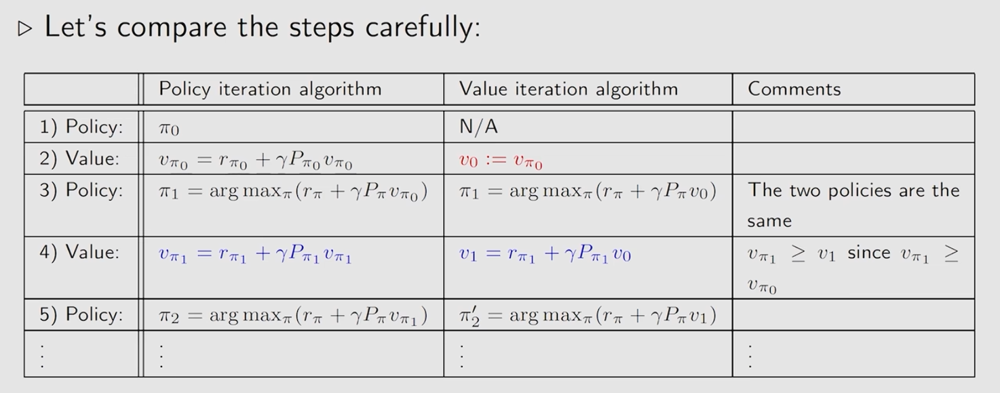
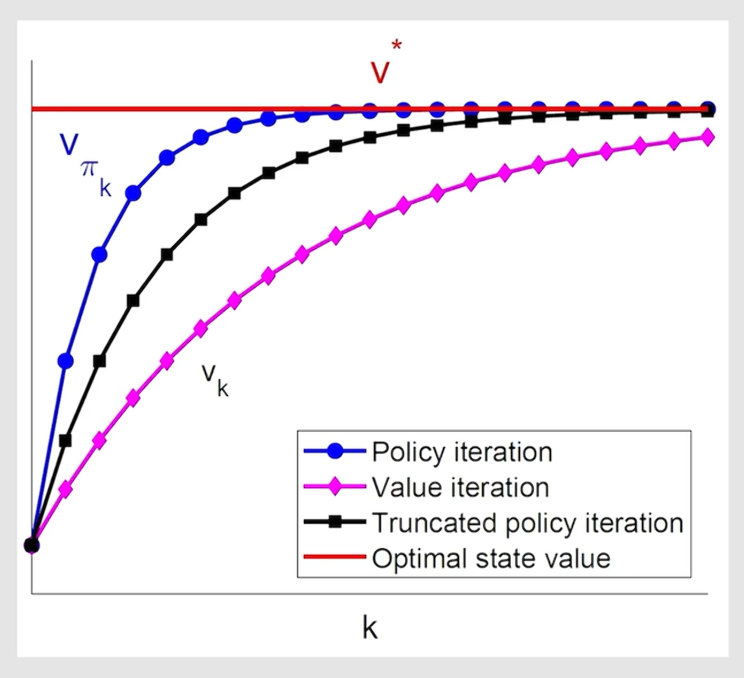

# ch4 Value Iteration and Policy Iteration Algorithm
> 参考: [【强化学习的数学原理】课程：从零开始到透彻理解（完结）](https://www.bilibili.com/video/BV1sd4y167NS/)

> 本章的算法还是 model-based 的, 下一章的算法是 model-free 的.


## part1: Value Iteration Algorithm
我们已知 BOE 的迭代求解, 这种求解方式被称为 **value iteration algorithm**, 这个算法的核心思想就是通过不断地迭代来求解 state value, 最终得到 optimal state value 和 optimal policy.

我们再来看一遍 BOE 的迭代求解:
$$
v_{k+1} = f(v_k) = \max_{\pi}(r_{\pi} + \gamma P_{\pi} v_{k}), k = 0, 1, 2, ...
$$
Step1: policy update, 主要是求解内层的优化问题:
$$
\pi_{k+1} = \arg\max_{\pi}(r_{\pi}+\gamma P_{\pi} v_{k})
$$
这里的 $v_{k}$ 是给定的
Step2: value update, 主要是更新值, 得到新的 $v_{k+1}$
$$
v_{k+1} = r_{\pi_{k+1}}+\gamma P_{\pi_{k+1}} v_{k}
$$
Q: 这里的 $v_k$ 是 state value 吗?

A: 不是，因为 $v_k$ 不一定满足 $v_k = r_{\pi} +\gamma P_{\pi} v_{k}$

对于 BOE 的 elementwise form:
$$
\pi_{k+1} = \arg \max_{\pi} \sum_{a}\pi(a|s)\left(\sum_{r}p(r|a, s)r+\gamma\sum_{s^{'}}p(s^{'}|a, s)v(s^{'}) \right), s\in \mathcal{S}
$$
这里的 $\pi_{k+1}$ 具体的形状在上一章已经介绍过了

也是两个 steps

### algorithmic form
```pseudo code
Init: the probility model p(r|s, a) and p(s'|s, a), for all (s, a), initialize guess v_0

while ||v_k - v_{k+1}|| > \theta
	for every state s in S do
		for every action a in A do
			q-value: q(s, a) = \sum_{r} p(r|s, a)r + \gamma \sum_{s'} p(s'|s, a)v_k(s')
		maximum action: a^{*}_{k}(s) = \arg\max_{a} q(s, a)
		policy update: \pi_{k+1}(a|s) = 1 if a = a^{*}_{k}(s) else 0
		<!-- 这里的 policy update 可以省略 -->
		value update: v_{k+1}(s) = \max_{a} q(s, a)
end while
```

### example
参考[值迭代与策略迭代](https://www.bilibili.com/video/BV1sd4y167NS?p=13)


## part2: Policy Iteration Algorithm
给定一个 random policy $\pi_0$

step1: Policy evaluation(PE): 

计算 $\pi_k$ 的 state value $v_{\pi_k}$:
$$
v_{\pi_k} = r_{\pi_k} + \gamma P_{\pi_k} v_{\pi_k}
$$
step2: Policy improvement(PI):
$$
\pi_{k+1} = \arg\max_{\pi}(r_{\pi} + \gamma P_{\pi} v_{\pi_k})
$$
the maximization is componentwise(按分量逐个进行).

Q1: 在 PE step 中, 如何求解 state value $v_{\pi_k}$?

Q2: 在 PI step 中, 为什么 new policy $\pi_{k+1}$ 一定比 old policy $\pi_k$ 更好?

Q3: 为什么这样的 policy iteration algorithm 是收敛到最优的的?

Q4: policy iteration 与 value iteration 有何关系?

A1: 我们可以通过 bellman equation 去求解 state value $v_{\pi_k}$:
$$
v_{\pi_k} = r_{\pi_k} + \gamma P_{\pi_k} v_{\pi_k}\\
\text{or it's closed-form solution: }\\
 v_{\pi_k} = (I - \gamma P_{\pi_k})^{-1} r_{\pi_k}
$$
因为这里涉及一个对逆矩阵的求解, 因此我们常常使用迭代的方法来求解 state value $v_{\pi_k}$

A2: 简要证明如下:
$$
\text{if }\pi_{k+1} = \arg\max_{\pi}(r_{\pi} + \gamma P_{\pi} v_{\pi_k})\\
\text{then }v_{\pi_{k+1}} \geq v_{\pi_k} \text{ for any }k
$$

A3: 
1. 因为 state value 是单调不减的
2. 因为 state value 是有上界的, 因此 state value 是收敛的
3. 关于为什么 state value 是具体收敛到 optimal state value 的证明, 这里略过

### algorithmic form
```pseudo code
Init: the probility model p(r|s, a) and p(s'|s, a), for all (s, a), initialize random policy \pi_0

while \pi_k != \pi_{k+1}
	Policy evaluation:
	Init: v_{\pi_k}^{(0)}, \theta
	while ||v_{\pi_k}^{(i)} - v_{\pi_k}^{(i+1)}|| > \theta
		for every state s in S do
			v_{\pi_k}^{(i+1)}(s) = \sum_{a} \pi_k(a|s) \left(\sum_{r} p(r|s, a)r + \gamma \sum_{s'} p(s'|s, a)v_{\pi_k}^{(i)}(s')\right)
		end for
	end while

	policy improvement:
	for every state s in S do
      	for every action a in A do
			q(s, a) = \sum_{r} p(r|s, a)r + \gamma \sum_{s'} p(s'|s, a)v_{\pi_k}(s')
		a^{*}_{k}(s) = \arg\max_{a} q(s, a)
		\pi_{k+1}(a|s) = 1 if a = a^{*}_{k}(s) else 0
	end for
```

### example
具体数值计算的例子可以参考 [值迭代与策略迭代](https://www.bilibili.com/video/BV1sd4y167NS?p=14)

还可以注意到一个情况是距离 target state 近的 state 的 policy 更新的速度更快.

## part3: truncated policy iteration algorithm
我们通过下面这个表格比较一下 value iteration, policy iteration:

这里第二步的 value iteration 的 $v_0 = v_{\pi_0}$ 是为了便于比较, 强行让其相等的, 实际上 value iteration 的 $v_0$ 是一个随机的值.

仔细看主要的区别在于第四步, 此时 policy iteration 相当于求解一个 bellman equation, 而 value iteration 只是进行了一次迭代, 因此 policy iteration 的 policy evaluation step 的计算量更大一些.

但如果我们用迭代法求解 bellman equation 的话, 那么 policy iteration 的 PE step 就相当于计算无穷步, 而 value iteration 的 PU step 就相当于计算一步, 因此我们可以通过调整 policy iteration 的 PE step 的迭代步数来得到一个介于 value iteration 和 policy iteration 之间的算法, 这个算法叫做 truncated policy iteration algorithm.

### algorithmic form
与 policy iteration algorithm 的区别在于 policy evaluation step 的迭代步数, 其他的步骤都是一样的.

这里省略

但是需要注意的是 truncated policy iteration 的 PE step 得到的与 policy iteration 的 PE step 得到的 state value 是不一样的, 这时我们不能说 truncated policy iteration 得到的是 $v_{\pi}$ 了. 那么这里是否导致不再收敛等一些问题呢?

直观上可以理解是不会的. 这里我们可以证明当迭代 PE 求 $v_{\pi_{k+1}}$ 时, 如果采用一个比较特殊的 initial value $v_0 = v_{\pi_k}$, 那么它是单调递增的.

我们可以看一下几种算法各自的效果:


## summary
- value iteration algorithm: 通过不断地迭代来求解 state value, 最终得到 optimal state value 和 optimal policy.
- policy iteration algorithm: 通过不断地进行 policy evaluation 和 policy improvement 来求解 optimal policy.
- truncated policy iteration algorithm: 通过调整 policy iteration 的 PE step 的迭代步数来得到一个介于 value iteration 和 policy iteration 之间的算法.
