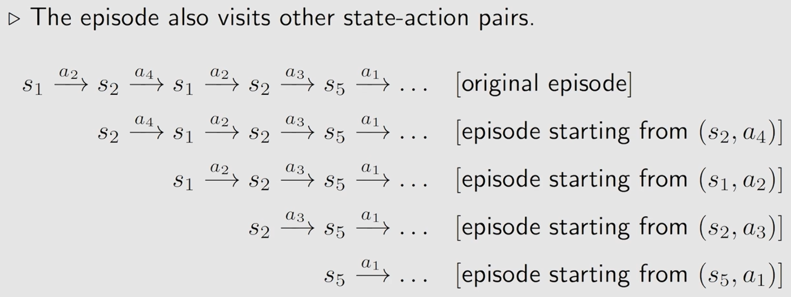
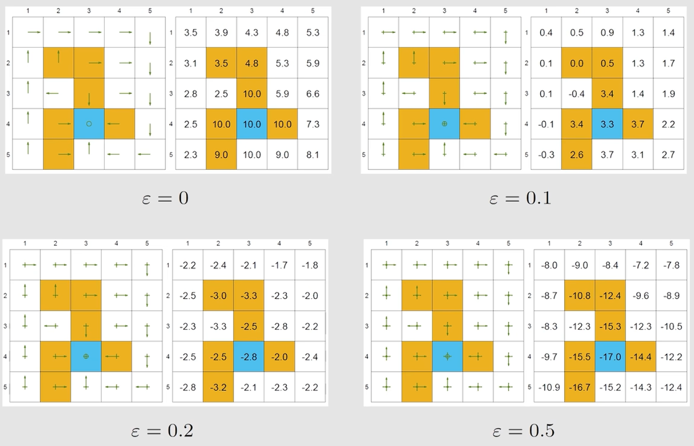

# ch5 Monte Carlo Learning
> 参考: [【强化学习的数学原理】课程：从零开始到透彻理解（完结）](https://www.bilibili.com/video/BV1sd4y167NS/)

> 上一章学习的 value iteration 和 policy iteration 都是 model-based 的算法, 现在我们来学习第一个 model-free 的算法, 也就是 Monte Carlo Learning.

上一章学习的 value iteration 和 policy iteration 统称为 model-based reinforcement learning, 更准确的说, 它们都是 DP 的方法

## part1: Movtivaing example - monte carlo
比如我们抛硬币, 如果是正面朝上我们就奖励 +1, 如果是反面朝上我们就奖励 -1, 现在我们想要知道在这个环境中, 我们抛硬币的期望 reward 是多少.

假设我们现在并不知道这个环境的 dynamics model, 也就是说我们不知道这个环境的 transition probability 和 reward function, 那么我们就无法使用 value iteration 或者 policy iteration 来求解 state value.

但是我们可以通过采样来估计 state value, 也就是 Monte Carlo Learning 的核心思想.

假设我们抛了许多次硬币, 获得了一个 sample sequence: $\{x_1, x_2, \ldots, x_n\}$ 那么, mean:
$$
\mathbb{E}[x] \approx \bar{x} = \frac{1}{n}\sum_{i=1}^{n} x_i
$$
当 $n \to \infty$ 的时候, $\bar{x} \to \mathbb{E}[x]$, 这就是 Monte Carlo Learning 的核心思想, 通过大量的采样来估计期望值.

为什么我们要关注 mean? 因为 state value 和 action value 都是 return 的期望值, 因此我们需要通过采样来估计这个期望值.

## part2: MC basic - introduction
the key to understand the algorithm is to understand **how to convert the policy iteration algorithm to be model-free**.

我们先来看 policy iteration 的 PI step:
$$
\pi_{k+1} = \arg\max_{\pi}(r_{\pi} + \gamma P_{\pi} v_{\pi_k})\\
= \arg\max_{\pi}\sum_{a}\pi(a|s)q_{\pi_k}(s, a), s \in \mathcal{S}
$$
这里的 $q_{\pi_k}(s, a)$ 是 action value

一般我们可以通过展开来计算 $q_{\pi_k}(s, a)$, 但是这种方式需要我们知道环境的 dynamics model, 而在model-free 的情况下, 我们可以通过采样的方式计算:
$$
q_{\pi_k}(s, a) = \mathbb{E}_{\pi_k}[G_t|S_t=s, A_t=a] \approx \frac{1}{n}\sum_{i=1}^{n} G_i
$$
因此, the precedure of Monte Carlo estimation of action value is:
- 从 $(s,a)$ 出发, 遵循 policy $\pi_k$ 采样一个 episode, 得到 return $g(s,a)$
- $g(s,a)$ 是 $G_t$ 的一个 sample in:
$$
q_{\pi_k}(s, a) = \mathbb{E}_{\pi_k}[G_t|S_t=s, A_t=a] \approx \frac{1}{n}\sum_{i=1}^{n} G_i
$$
- 假设我们重复了很多 episode, 那么我们就获得了 sample set $\{g^{(i)}(s, a)\}$
- 此时我们就可以求出 $q_{\pi_k}(s, a)$ 的 estimate

**总而言之, 在没有数据的情况下得有模型, 没有模型的情况下得有数据** 这里的数据在统计学中被称为 sample, 在 RL 中叫做 experience

### MC basic
给定初始策略 $\pi_0$, 之后在第 $k$ 次迭代:
- **step1: policy evaluation**: 这一步是对于所有 $(s,a)$ 求 $q_{\pi_k}(s, a)$. 具体来说, 对于每一个 state-action pair $(s,a)$, run an infinite number (or a large number) of episodes, 计算 $q_{\pi_k}(s, a)$ 的 estimate
- **step2: policy improvement**: 这一步是对于所有 state $s$, 选择 action $a$ 来最大化 $q_{\pi_k}(s, a)$, 从而得到新的 policy $\pi_{k+1}$

这个算法与 policy iteration 的区别在于, policy iteration 是通过求解 Bellman equation 来计算 state value 和 action value, 而 Monte Carlo Learning 是通过采样来估计 state value 和 action value.
### algorithmic form
略, 大体与 policy iteration 的 algorithmic form 类似

我们可以发现: 
- MC basic 是 policy iteration 的一个变种
- 这个 model-free 的算法是基于 model-based 的算法的
- MC basic is useful to reveal the core idea of MC-based model-free RL, 但是实际上我们并不使用这个算法, 因为它的效率太低了.
- MC basic 是 [【强化学习的数学原理】课程：从零开始到透彻理解（完结）](https://www.bilibili.com/video/BV1sd4y167NS/) 中自己起的一个名字, 因为作者认为在学习时应该先将所有看上去复杂的东西剥离开来, 先理解核心的思想, 之后再搞清楚如何加速.
- 为什么要估计 action value 而不是 state value 呢? 因为如果我们估计 state value 的话, 我们又需要转成 action value 而这又需要 model 了.
- 因为 policy iteration 是收敛的, 因此 MC basic 的收敛性也是可以保证的. 但是随着之后的算法越来越复杂, 这种收敛性会逐渐消失或者是难以分析.

## part3: MC basic - example
略.

examine the impact of episode length: how long should an episode be?

需要根据具体的问题来具体的分析

## part4: MC exploring starts
现在考虑一个 grid-world 的例子, 遵循 policy $\pi$, 我们可以得到下面的一个 episode:
$$
s_{1} \xrightarrow{a_{2}} s_{2} \xrightarrow{a_{4}} s_{1} \xrightarrow{a_{2}} s_{3} \xrightarrow{a_{3}} s_{5} \xrightarrow{a_{1}} ...
$$
- **visit**: 每当一个 state-action pair $(s,a)$ 出现一次, 就称为 visit 了一次
- methods to use the data: initial-visit method:
  - just calculate the return and approximate $q_{\pi}(s, a)$
  - MC basic does
  - 没有充分利用 data

现在看下面这个例子:

这样就可以同时 estimate $q_{\pi}(s_1, a_{2})$, $q_{\pi}(s_2, a_{4})$, $...$, 这样就充分利用了 data.

有两种不同的方式来实现这个 idea:
- first-visit method: 只计算 episode 中第一次 visit 的 state-action pair 的 return
- every-visit method: 计算 episode 中每一次 visit 的 state-action pair 的 return

除了怎么样更加高效的利用数据以外, 还可以考虑去怎么样更加高效的更新 policy.

这里也有两种不同的方式:
- the first method: 在一次 PE step 中, 先收集到从一个 state-action pair 出发的所有 episode, 之后再计算 average return
- the second method: 在一次 PE step 中, 每当一个 episode 结束后, 就立即更新 policy, 之后再进行下一个 episode 的采样

the second method 是否会出现问题呢?

考虑上一章学习的 truncated policy iteration algorithm, 其中 policy improvement step 是在 policy evaluation step 的过程中进行的. 这里我们用一个 episode 去估计显然是不精确的, 但是没有关系.

### Generalized policy iteration (GPI)
这是一大类算法的统称, 或者说是一类思想或架构.

我们上一章介绍的 truncated policy iteration algorithm 和这里的 MC exploring starts 都是 GPI 的算法.

### algorithmic form
略

MC exploring starts 中的 "exploring starts" 是指在每一次 episode 的开始, 都随机地选择一个 state-action pair 来开始采样, 这样就保证了每一个 state-action pair 都有机会被 visit 到, 从而保证了算法的收敛性.

但是在实际中我们不能随意的设置 starts, 因此我们需要引入 epsilon-greedy 的方法来保证每一个 state-action pair 都有机会被 visit 到, 从而保证了算法的收敛性.

### 收敛性证明
略, 待更新

## part5: MC epsilon-greedy - introduction
### soft policy
policy 分成两种, 一种是 deterministic policy, 另一种是 stochastic policy.
- greedy policy 就是 deterministic policy
- soft policy $\epsilon$-greedy 就是 stochastic policy

with a soft policy, 如果这个 episode 特别长, 那么理论上我们可以 visit 到所有的 state-action pair, 那么我们就可以去掉 "exploring starts" 这样一个条件了.

> 马尔科夫链的遍历性, 简单来说就是: 无论从哪个 state 出发, 跑足够久之后, 落在每个状态的概率会稳定下来, 且与初始状态无关.
>
> 要求该马尔科夫链是 irreducible 的, 也就是说对于任意两个状态 $s$ 和 $s'$, 都存在一个正整数 $n$ 使得从状态 $s$ 出发经过 $n$ 步能够以正概率到达状态 $s'$.
>
> 要求该马尔科夫链是 aperiodic 的, 也就是说对于任意状态 $s$, 从状态 $s$ 出发经过 $n$ 步能够以正概率回到状态 $s$ 的步数 $n$ 的最大公约数为 1.

我们一般使用的 soft policy 是 $\epsilon$-greedy, 也就是说在每一个 state 下, 以 $1-\epsilon$ 的概率选择 greedy action, 以 $\epsilon$ 的概率随机选择一个 action.

$$
\pi(a|s) = \begin{cases} 1- \frac{\epsilon}{|\mathcal{A}(s)|}(|\mathcal{A}(s)|-1), & \text{if } a = a^{*}\\
\frac{\epsilon}{|\mathcal{A}(s)|}, & \text{otherwise}
\end{cases}\\
\text{where } a^{*} = \arg\max_{a} q(s, a)
$$
为什么我们要使用 $\epsilon$-greedy 呢?
- 因为它可以平衡 exploration 和 exploitation(剥削, 充分利用), 从而保证算法的收敛性
  - 当 $\epsilon$ 趋近于 0 的时候, 我们就只关注 exploitation, 也就是 greedy action
  - 当 $\epsilon$ 趋近于 1 的时候, 我们就只关注 exploration, 也就是随机 action
- 因为它简单易实现, 也比较有效

### how to embed the $\epsilon$-greedy method into MC-based RL algorithm?
originally, 在 MC basic and MC exploring starts 的 PI step 中:
$$
\pi_{k+1} = \arg\max_{\pi\in \Pi}\sum_{a}\pi(a|s_k)q_{\pi_{k}}(s_k, a)
$$
这里的 $\Pi$ 是所有的 deterministic policy 的集合. 我们求解出来的 optimal policy 是:
$$
\pi_{k+1}(a|s_k) = \begin{cases} 1, & \text{if } a = a^{*}\\
0, & \text{otherwise}
\end{cases}\\
\text{where } a^{*} = \arg\max_{a} q_{\pi_{k}}(s_k, a)
$$

现在我们要将 $\Pi$ 替换成所有的 $\epsilon$-greedy policy 的集合, 也就是说:
$$
\pi_{k+1} = \arg\max_{\pi\in \Pi_{\epsilon}}\sum_{a}\pi(a|s_k)q_{\pi_{k}}(s_k, a)
$$
这里的 $\Pi_{\epsilon}$ 是所有的 $\epsilon$-greedy policy 的集合. 这样我们就得到了一个新的 optimal policy:
$$
\pi_{k+1}(a|s_k) = \begin{cases} 1- \frac{\epsilon}{|\mathcal{A}(s_k)|}(|\mathcal{A}(s_k)|-1), & \text{if } a = a^{*}\\
\frac{\epsilon}{|\mathcal{A}(s_k)|}, & \text{otherwise}
\end{cases}\\
\text{where } a^{*} = \arg\max_{a} q_{\pi_{k}}(s_k, a)
$$
这个算法与 MC exploring starts 是很像的, 除了 MC exploring starts 是在每一次 episode 的开始, 都随机地选择一个 state-action pair 来开始采样, 而 MC epsilon-greedy 是在每一次 episode 的开始, 都按照 $\epsilon$-greedy 的方式来选择 action 来开始采样. 这样就保证了每一个 state-action pair 都有机会被 visit 到, 从而保证了算法的收敛性.

## part6: MC epsilon-greedy - examples
可以参考 [MC epsilon-greedy - examples](https://www.bilibili.com/video/BV1sd4y167NS?p=21) 这里面有相关例子的视频模拟

$\epsilon$-greedy 策略牺牲了最优性, 因为它在探索和利用之间进行了权衡, 而不是完全专注于利用已知的最佳动作.

比较两个策略是通过比较 state value 来进行的, 我们可以发现即使所有的策略是 consistent 的, 但是它们之间的 max state value 也是不一样的, 这也就说明了 $\epsilon$-greedy 策略牺牲了最优性, 因为它在探索和利用之间进行了权衡, 而不是完全专注于利用已知的最佳动作.

如果想要使用 $\epsilon$-greedy 策略来得到一个 optimal policy, 那么我们需要让 $\epsilon$ 随着时间的推移逐渐减小, 这样就可以在初始阶段进行更多的探索, 在后续阶段进行更多的利用, 从而最终得到一个 optimal policy.

## summary
- mean estimation by the Monte Carlo method
- three algorithms:
  - MC basic: 通过采样来估计 state value 和 action value, 从而进行 policy improvement
  - MC exploring starts: 在每一次 episode 的开始, 都随机地选择一个 state-action pair 来开始采样, 从而保证了每一个 state-action pair 都有机会被 visit 到, 从而保证了算法的收敛性
  - MC epsilon-greedy: 在每一次 episode 的开始, 都按照 $\epsilon$-greedy 的方式来选择 action 来开始采样, 从而保证了每一个 state-action pair 都有机会被 visit 到, 从而保证了算法的收敛性
- relationship among these three algorithms
- optimality vs exploration of $\epsilon$-greedy policy