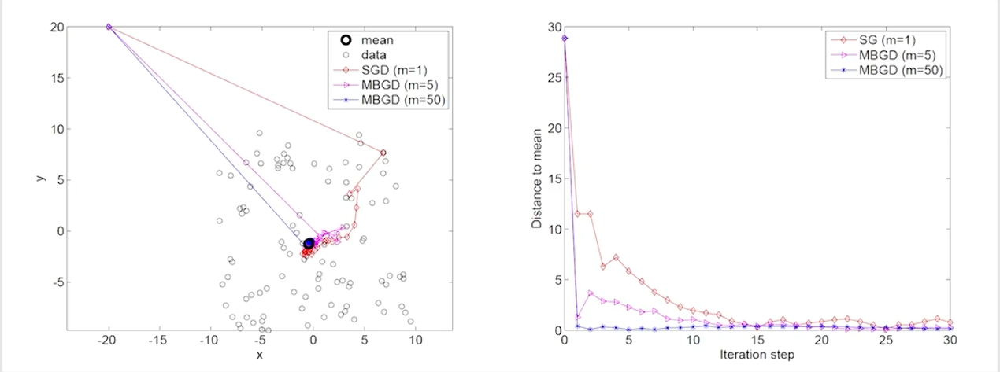

# ch6 stochastic approximation
> 参考: [【强化学习的数学原理】课程：从零开始到透彻理解（完结）](https://www.bilibili.com/video/BV1sd4y167NS/)

## part1: motivating example: iterative mean estimation
有关上一节的 mean:
$$
\mathbb{E}[x]\approx \bar{x} := \frac{1}{n}\sum_{i=1}^{n}X_i
$$
有两种计算方法:
1. 收集所有 samples, 然后计算 mean
2. 每当一个新的 sample $X_{n+1}$ 来了, 就更新 mean 的 estimate

有关第二种方法, 首先, 我们可以定义:
$$
w_{k+1} = \frac{1}{k}\sum_{i=1}^{k}x_i, k = 1, 2, \ldots
$$
因此:
$$
w_{k} = \frac{1}{k-1}\sum_{i=1}^{k-1}x_i
$$
我们可以推出:
$$
w_{k+1} = w_k - \frac{1}{k}(w_k - x_k)
$$
这样我们就得到了一个迭代式的算法.

有关下面的式子:
$$
w_{k+1} = w_k - \alpha_k(w_k - x_k)
$$
令其中的 $\alpha_k = \frac{1}{k}$, 就得到了上面的式子.

这种算法实际上就是一种特殊的 stochastic approximation algorithm, 也是一种特殊的 stochastic gradient descent algorithm

## part2: RM algorithm: introduction and examples
stochastic approximation (SA):
- SA 指的是一类算法, 其核心思想是通过迭代的方式来求解一个方程或者一个优化问题.
- SA 的一个特点是, 它不需要知道方程或者优化问题的具体形式, 只需要通过采样来估计方程或者优化问题的解.

Robbins-Monro (RM) algorithm:
- 是 SA 的一个经典算法.
- SGD 算法也是 SA 的一个经典算法
- mean estimation 也是一种特殊的 RM algorithm

problem statement:

solve $g(w) = 0$
- 许多问题都能转换为求解一个方程 $g(w) = 0$ 的问题, 例如需要求解一个优化问题 $\min_{w} J(w)$, 也可以转换为求解 $g(w) = \nabla_{w} J(w) = 0$ 的问题.

对于求解 $g(w) = 0$
- 如果我们知道具体表达式, 那么有多种方法可以求解.
- 如果我们不知道具体表达式, 这个问题就可以通过 RM algorithm 来求解.

RM algorithm:
$$
w_{k+1} = w_k - \alpha_{k} \tilde{g}(w_k, \eta_{k})
$$
其中:
- $w_k$ 是第 $k$ 次迭代的 root estimate
- $\tilde{g}(w_k, \eta_{k}) = g(w_k) + \eta_{k}$ 是 $k$ 次迭代的 noisy root estimate, 其中 $\eta_{k}$ 是一个随机变量, 其期望值为 0, 方差为 $\sigma^2$
- $\alpha_k$ 是 positive coefficient

这里面的 $\tilde{g}(w_k, \eta_{k})$ 是一个黑盒, 我们不知道它的具体表达式

### examples:
略

## part3: RM algorithm: convergence analysis
the above analysis is intuitive, but it is not rigorous. 

in the RM algorithm, if:
1. $0 < c_1 \leq \nabla_{w} g(w) \leq c_2 $ for all $w$;
2. $\sum_{k=1}^{\infty} \alpha_k = \infty$ and $\sum_{k=1}^{\infty} \alpha_k^2 < \infty$;
3. $\mathbb{E}[\eta_k | \mathcal{H}_k] = 0$ and $\mathbb{E}[\eta_k^2 | \mathcal{H}_k] \leq \infty$

where $\mathcal{H}_k = \{w_k, w_{k-1}, \ldots, w_1\}$, them $w_k$ converges to the root of $g(w) = 0$ with probability 1 (w.p.1).

- 条件1 表示 $g(w)$ 在整个定义域上是单调递增的
- 条件2 后者保证了 $\alpha_k$ 的收敛性, 会逐渐收敛至 0, 前者保证了 $\alpha_k$ 的发散性, 不会过快地收敛至 0
- 条件3 表示 $\tilde{g}(w_k, \eta_{k})$ 是 $g(w_k)$ 的一个 unbiased estimate, 也就是说 $\tilde{g}(w_k, \eta_{k})$ 的期望值等于 $g(w_k)$, 同时 $\tilde{g}(w_k, \eta_{k})$ 的方差是有限的

实践中一般我们不会让 $\alpha_k = \frac{1}{k}$ , 而是选择一个趋近一个很小的数, 因为如果选择为 $\frac{1}{k}$ 的话, 后面的数据起到的作用就会很小了, 虽然这样不满足条件2, 但是在实践中是可行的. 

### mean estimation 的 RM algorithm 的 convergence analysis:
考虑下面的函数:
$$
g(w)\doteq w-\mathbb{E}[x]
$$
我们可以发现:
$$
\tilde{g}(w, x) \doteq w - x
$$
可以注意到:
$$
\tilde{g}(w,\eta) = w-x = (w-\mathbb{E}[x]) + (\mathbb{E}[x] - x) = g(w) + \eta
$$
因此 RM algorithm 的 update rule 可以写成:
$$
w_{k+1} = w_k - \alpha_k \tilde{g}(w_k, x_k) = w_k - \alpha_k(w_k - x_k)
$$

### Optional: RM algorithm 的 convergence analysis 的 proof sketch:
证明 RM 定理:

略

## part4: SGD algorithm: introduction
SGD 实际上是 RM 的一个特殊情况, mean estimation 实际上也是 SGD 的一个特殊情况.

SGD 要解决的问题是这样的一个优化问题:
$$
\min_{w} J(w) = \mathbb{E}[f(w, X)]
$$

**method 1: Gradient Descent (GD)**
$$
w_{k+1} = w_k - \alpha_k \nabla_{w} \mathbb{E}[f(w, X)] = w_k - \alpha_k \mathbb{E}[\nabla_{w} f(w_k, X)]
$$
drawback: 不好求解 $\mathbb{E}[\nabla_{w} f(w, X)]$

**method 2: Batch Gradient Descent (BGD)**
$$
\mathbb{E}[\nabla_{w} f(w, X)] \approx \frac{1}{n}\sum_{i=1}^{n} \nabla_{w} f(w, x_i)\\
w_{k+1} = w_k - \alpha_k \frac{1}{n}\sum_{i=1}^{n} \nabla_{w} f(w_k, x_i)
$$
drawback: 要求很多数据

**method 3: Stochastic Gradient Descent (SGD)**
$$
w_{k+1} = w_k - \alpha_k \nabla_{w} f(w_k, x_k)
$$
**注意:** 这里原本的的 $X$ 是一个随机变量, 但是在 SGD 中我们用 $x_k$ 来代替 $X$

compare with BGD: 相当于令 $n=1$ 的时候的 BGD

## part5: SGD algorithm: examples and convergence
### examples:
略
### convergence:
我们可以通过将 SGD 转化为 RM 来分析 SGD 的收敛性:

具体的略

## part6: SGD algorithm: interesting properties
一个例子:

在一个二维平面直角坐标系中，我们在20*20中心在(0,0)的正方形范围中随机采样100个点，一开始我们估计mean是在(20,20)，真实值应该在(0,0)，之后使用SGD进行计算。

我们可以看一下结果:

可以发现 SGD 最后是逼近了真实值的, 可以发现在较远的地方, SGD 更新的方向是大致正确的, 但在接近真实值的时候, SGD 就开始出现不确定性了.

### A deteministic formulation
在别的地方可能会看到这样的一个公式:
$$
\min_{w} J(w) = \frac{1}{n}\sum_{i=1}^{n} f(w, x_i)
$$
- a set of real numbers $x_1, x_2, \ldots, x_n$ are given, which is not variable samples from a distribution

那么这个算不算 SGD 呢?

在实际中可能这样的一个 set $\{x_i\}$ 是比较大的, 我们一次只能得到其中的一部分, 那这个算 SGD 吗? 这里面没有任何的随机变量, 也没有任何的 expectation, 还有就是我们应该怎么从里面拿数据进行更新呢?

我们可以手动引入一个 random variable, 引入一个随机变量 $X$ 来表示从 $\{x_i\}$ 中随机采样得到的一个数据, 那么我们就可以将上面的式子转化为:
$$
\min_{w} J(w) = \mathbb{E}[f(w, X)]
$$
可以令:
$$
p(X = x_i) = \frac{1}{n}
$$
此时我们上面的问题就迎刃而解了.

## part7: SGD algorithm: compare BGD, MBGD and SGD
$$
w_{k+1} = w_k - \alpha_{k} \frac{1}{n}\sum_{i=1}^{n} \nabla_{w} f(w_k, x_i) \tag{BGD}
$$
$$
w_{k+1} = w_k - \alpha_{k} \frac{1}{m}\sum_{i=1}^{m} \nabla_{w} f(w_k, x_i) \tag{MBGD}
$$
$$
w_{k+1} = w_k - \alpha_{k} \nabla_{w} f(w_k, x_k) \tag{SGD}
$$

- 与 SGD 相比, MBGD 的随机性更小, 因为它使用了更多的采样
- 与 BGD 相比, MBGD 的计算效率更高, 因为它使用了更少的采样
- 当 $m=1$ 的时候, MBGD 就退化成了 SGD
- 当 $m=n$ 的时候, MBGD 并不等于 BGD, 因为 MBGD 的 m 个采样是有放回随机抽取的, 可能有的样本被抽取了多次, 可能有的样本没有被抽取到, 而 BGD 是使用了所有的样本进行计算的, 这个微小差别可以忽略不计

