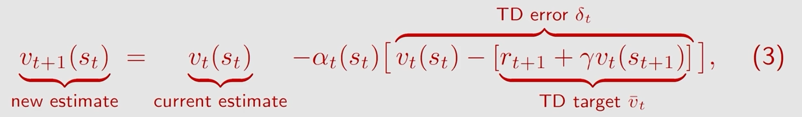
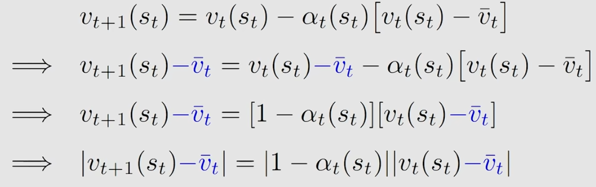
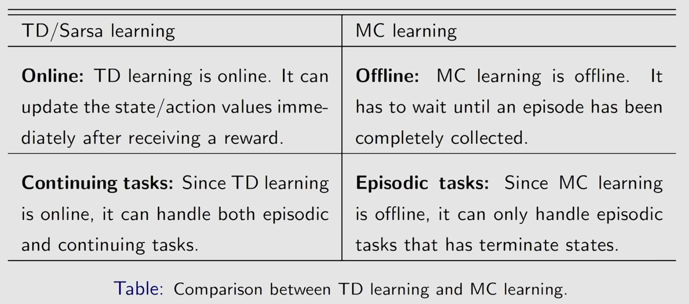
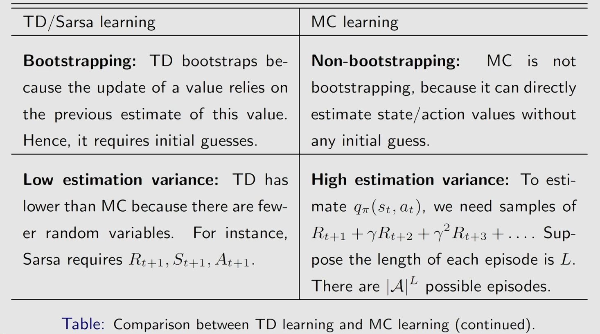
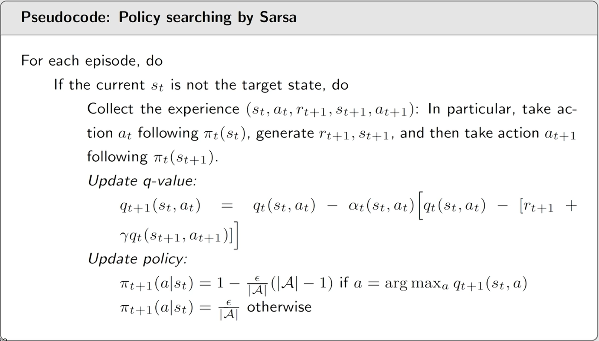
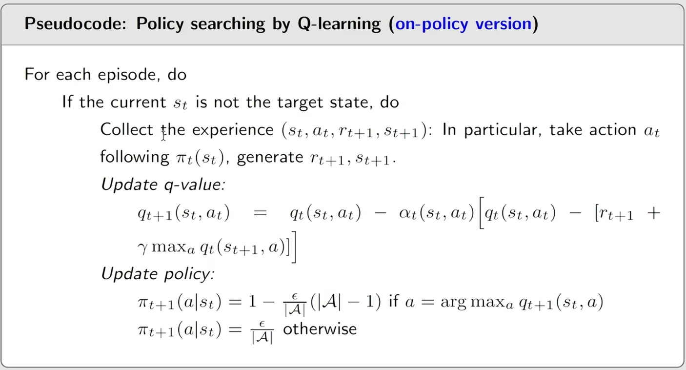
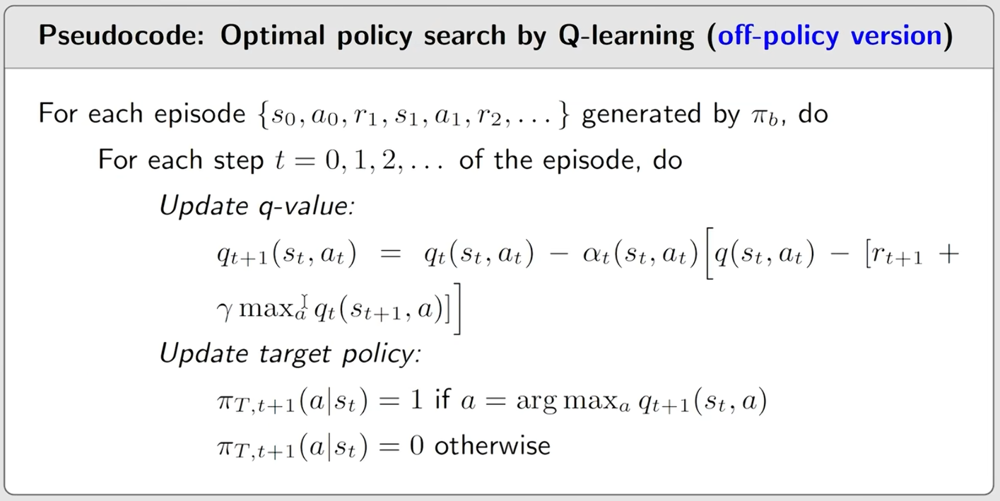
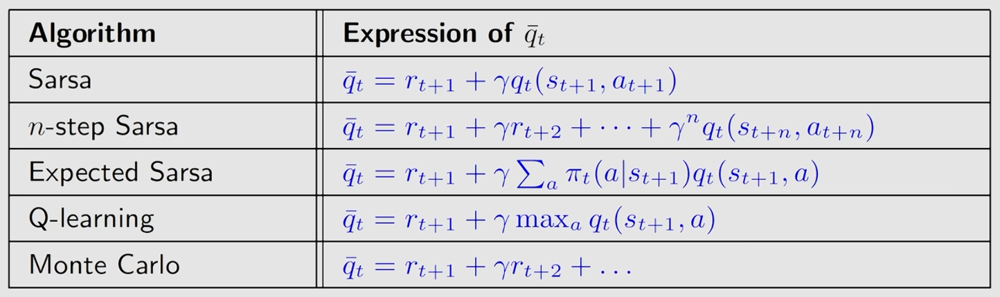
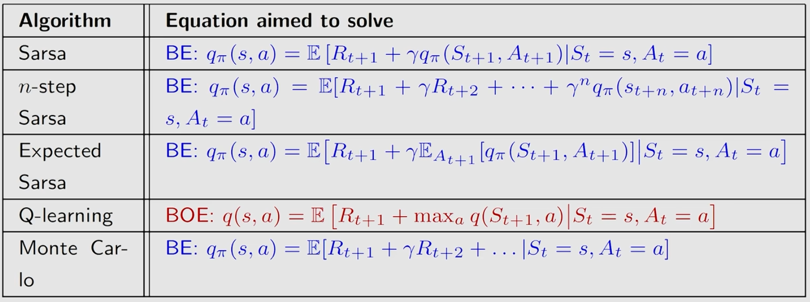

# ch7 Temporal Difference Learning
> 参考: [【强化学习的数学原理】课程：从零开始到透彻理解（完结）](https://www.bilibili.com/video/BV1sd4y167NS/)

## part1: Motivating example
首先, 考虑一个简单的例子:

计算 $w=\mathbb{E}[X]$ , 其中 $\{x\}$ 是 iid 样本

- 首先我们将 $g(w) = w-\mathbb{E}[X]$ 之后我们相当于要求 $g(w)=0$ 的解
- 因为我们可以获得 $X$ 的样本 $\{x\}$ 那么 noisy observations of $g(w)$ 就是:
$$
\tilde{g}(w,\eta) = w - x = (w - \mathbb{E}[X]) + (\mathbb{E}[X] - x) = g(w) + \eta
$$
- 因此我们通过 RM 可以得到:
$$
w_{k+1} = w_k - \alpha_k \tilde{g}(w_k, \eta_k) = w_k - \alpha_k (w_k - x_k)
$$

接下来看第二个例子:

计算 $w = \mathbb{E}[v(x)]$, 其中 $\{x\}$ 是 iid 样本
- 我们可以先定义 $g(w) = w - \mathbb{E}[v(x)]$
- 那么 noisy observations of $g(w)$ 就是:
$$
\tilde{g}(w, \eta) = w - v(x) = (w - \mathbb{E}[v(x)]) + (\mathbb{E}[v(x)] - v(x)) = g(w) + \eta
$$
- 因此我们通过 RM 可以得到:
$$
w_{k+1} = w_k - \alpha_k \tilde{g}(w_k, \eta_k) = w_k - \alpha_k (w_k - v(x_k))
$$

最后我们再看一个更加复杂的例子:

计算 $w = \mathbb{E}[R + \gamma v(X)]$ 其中 $R$ 和 $X$ 是随机变量
- 假设我们有 $R$ 和 $X$ 的样本 $\{r\}$ 和 $\{x\}$ 那么我们可以定义 $g(w) = w - \mathbb{E}[R + \gamma v(X)]$
- 那么 noisy observations of $g(w)$ 就是:
$$
\tilde{g}(w, \eta) = w - (r + \gamma v(x)) \\
= (w - \mathbb{E}[R + \gamma v(X)]) + (\mathbb{E}[R + \gamma v(X)] - (r + \gamma v(x))) \\
= g(w) + \eta
$$
- 因此我们通过 RM 可以得到:
$$
w_{k+1} = w_k - \alpha_k \tilde{g}(w_k, \eta_k) = w_k - \alpha_k (w_k - (r_k + \gamma v(x_k)))
$$

## part2: TD algorithm: introduction and interpretation
### TD learning of state values
note that:
- TD learning is a broad class of RL algorithms
- TD learning also refers a specific algorithm for learning state values as below

假定已有数据 $(s_0, r_1, s_1, r_2, s_2, \ldots, s_{t+1})$ 根据 $\pi$ 生成

那么 TD learning 就是:
$$
v_{t+1}(s_t) = v_t(s_t) + \alpha_{t}(s_{t})(v_t(s_{t})-(r_{t+1} +\gamma v_t(s_{t+1})))\tag{1}
$$
$$
v_{t+1}(s) = v_t(s), \forall s \neq s_t\tag{2}
$$

首先, 为什么 $\bar{v}_t$ 称作 TD target? 

**为了让算法去将 $v(s_t)$ 向其 TD target $\bar{v}_t$ 进行更新**

我们来看一下这个变形:

我们可以推出: $|v_{t+1}(s_t) - \bar{v}_t|\leq |v_{t}(s_t) - \bar{v}_t|$

这就说明 $v_{t+1}(s_t)$ 比 $v_t(s_t)$ 更接近 $\bar{v}_t$

第二, 如何理解 TD error $\delta_t$?
$$
\delta_t = v(s_t) - (r_{t+1} + \gamma v(s_{t+1}))
$$
- 这描述了两个不同 step 之间的误差, 前者是在 t 时刻, 而后者是在 t+1 时刻, 因此它被称为 temporal difference error
- 这也描述了 $v_t$ 与 $v_{\pi}$ 之间的差异:
  - 定义 $\delta_{\pi, t} = v_{\pi}(s_t) - (r_{t+1} + \gamma v_{\pi}(s_{t+1}))$
  - 考虑到 $\mathbb{E}[\delta_{\pi, t}|S_t = s_t] = 0$
  - 因此 $v_{\pi}(s_t) = \mathbb{E}[R_{t+1} + \gamma v_{\pi}(S_{t+1})|S_t = s_t]$
  - 在期望意义上, TD error $\delta_t$ 就是 $v_t$ 与 $v_{\pi}$ 之间的差异
- 当前的 TD error 可以被理解为是一种 innovation.

properties:
- the TD algorithm in (3) only estimates the state value of a given policy $\pi$ .
  - 它不能估计 action values
  - 它不能搜索 optimal policy

## part3: TD algorithm: convergence and comparison
Q: TD 算法数学上在干什么?

A: 它在没有模型的情况下, 求解一个给定 policy 的 Bellman equation

首先我们先来看一下 bellman equation 的期望形式:
$$
v_{\pi}(s) = \sum_{a} \pi(a|s) \sum_{s', r} p(s', r|s, a)[r + \gamma v_{\pi}(s')]\\
= \mathbb{E}_{\pi}[R + \gamma v_{\pi}(S^{'})|S = s]\tag{5}
$$
为了求解 bellman equation, 我们可以使用 RM 算法.
- 首先, $g(v(s)) = v(s) - \mathbb{E}_{\pi}[R + \gamma v_{\pi}(S^{'})|S = s]$
- 我们可以 rewrite (5) as $g(v(s)) = 0$
- 之后是 RM 的流程, 这里略微省略一下 $\tilde{g}(v(s)) = v(s)-[r + \gamma v_{\pi}(s^{'})]$

之后我们将其代入可以得到:
$$
v_{k+1}(s) = v_k(s) - \alpha_k (v_k(s) - [r + \gamma v_{\pi}(s^{'})])\tag{6}
$$
但是这里有两个问题:
- 我们的经验一定是顺序的
- 这里有 $v_{\pi}$

我们可以这样调整:
- 将 $\{s,r,s'\}$ 换成 $\{s_t, r_{t+1}, s_{t+1}\}$ so that the algorithm can utilize the sequential samples in an episode
- 用当前的 $v_t$ 来替换 $v_{\pi}$ 

### 收敛性分析
略

### TD vs MC

	
## part4: Sarsa
TD learning 只能学习 state values, 那么我们如何学习 action values 呢?

接下来我们就介绍 Sarsa 算法, 这是一个 TD learning 的 extension, 可以学习 action values

我们将 TD learning 中的 $v(s)$ 替换为 action value $q(s, a)$, 之后我们就可以得到 Sarsa 算法:
$$
q_{t+1}(s_t, a_t) = q_t(s_t, a_t) + \alpha_{t}(s_{t}, a_{t})(q_t(s_{t}, a_{t})-(r_{t+1} +\gamma q_t(s_{t+1}, a_{t+1})))
$$
用到的数据是 $\{s_t, a_t, r_{t+1}, s_{t+1}, a_{t+1}\}$, 这也是为什么它被称为 Sarsa

可以发现 sarsa 和 td learning 几乎是一模一样的, 只是将 state value 替换为了 action value

sarsa 也是在解一个 bellman equation, 只是这个 bellman equation 是 action value 的 bellman equation:
$$
q_{\pi}(s, a) = \mathbb{E}_{\pi}[R + \gamma q_{\pi}(S^{'}, A^{'})|S = s, A = a], \forall s, a
$$

### 收敛性
略, 和 TD learning 的收敛性分析类似

### policy improvement
sarsa 相当于是 PI 算法中的 policy evaluation step, 因此我们可以将 sarsa 与 policy improvement 结合起来:

### example
略

## part5: Expected Sarsa and n-step Sarsa
expected sarsa 和 n-step sarsa 是 sarsa 的两个 extension, 可以提高 sarsa 的性能, 相对重要性没有这么高.

### expected sarsa
expected sarsa 的 update rule 是:
$$
q_{t+1}(s_t, a_t) = q_t(s_t, a_t) + \alpha_{t}(s_{t}, a_{t})(q_t(s_{t}, a_{t})-(r_{t+1} +\gamma \mathbb{E}[q_t(s_{t+1}, A_{t+1})]))
$$
其中
$$
\mathbb{E}[q_t(s_{t+1}, A_{t+1})] = \sum_{a} \pi(a|s_{t+1}) q_t(s_{t+1}, a)
$$
- 它的计算量变大了, 因为需要计算 $\mathbb{E}[q_t(s_{t+1}, A_{t+1})]$
- 它涉及到的随机变量也减少了, 因此它的 variance 也减少了

它解决了这样一个数学问题:
$$
q_{\pi}(s,a) = \mathbb{E}[R_{t+1}+\gamma\mathbb{E}_{A_{t+1}\sim\pi}[q_{\pi}(S_{t+1}, A_{t+1})]|S_t=s, A_t=a]
$$
上面的等式实际上是 bellman equation 的一个变形:
$$
q_{\pi} = \mathbb{E}[R_{t+1}+\gamma v_{\pi}(S_{t+1})|S_t=s, A_t=a]
$$

### n-step sarsa
n-step sarsa 的 update rule 是:

action value 的定义是:
$$
q_{\pi}(s,a) = \mathbb{E}[G_t|S_t=s, A_t=a]
$$
discounted return 的定义是:
$$
G_{t}^{(1)} = R_{t+1} + \gamma q_{\pi}(S_{t+1}, A_{t+1})\\
G_{t}^{(2)} = R_{t+1} + \gamma R_{t+2} + \gamma^2 q_{\pi}(S_{t+2}, A_{t+2})\\
\ldots\\
G_{t}^{(n)} = R_{t+1} + \gamma R_{t+2} + \ldots + \gamma^{n-1} R_{t+n} + \gamma^n q_{\pi}(S_{t+n}, A_{t+n})\\
\ldots\\
G_{t}^{(\infty)} = R_{t+1} + \gamma R_{t+2} + \ldots = G_t
$$
如果我们采用 $G_{t}^{(1)} 就是 sarsa, 如果我们采用 $G_{t}^{(n)}$ 就是 n-step sarsa, 如果我们采用 $G_{t}^{(\infty)}$ 就是 mc

我们可以发现:
- sarsa 的目标是 solve:
$$
q_{\pi}(s,a) = \mathbb{E}[G_{t}^{(1)}|S_t=s, A_t=a]
$$
- MC 的目标是 solve:
$$
q_{\pi}(s,a) = \mathbb{E}[G_{t}^{(\infty)}|S_t=s, A_t=a]
$$
- n-step sarsa 的目标是 solve:
$$
q_{\pi}(s,a) = \mathbb{E}[G_{t}^{(n)}|S_t=s, A_t=a]
$$

求解 n-step sarsa 的 update rule 就是:
$$
q_{t+n}(s_t, a_t) = q_t(s_t, a_t) + \alpha_{t}(s_{t}, a_{t})(q_t(s_{t}, a_{t})-(G_{t}^{(n)}))
$$

## part6: Q-learning: introduction and on-policy vs off-policy
Q-learning 是现在运用非常广泛的一个 RL 算法(虽然用的一般是 DQN), 它直接估计 optimal action value, 因此它不需要 PE 与 PI 交替进行.

### Q-learning 
Q-learning 的算法是:
$$
q_{t+1}(s_t,a_t) = q_{t}(s_t, a_t) - \alpha_{t}(s_t, a_t)(q_{t}(s_t, a_t) - (r_{t+1} + \gamma \max_{a\in\mathcal{A}} q_{t}(s_{t+1}, a))),\\
q_{t+1}(s, a) = q_{t}(s, a), \forall (s, a) \neq (s_t, a_t)
$$

- TD target 在 Q-learning 中是 $r_{t+1} + \gamma \max_{a\in\mathcal{A}} q_{t}(s_{t+1}, a)$
- TD target 在 Sarsa 中是 $r_{t+1} + \gamma q_{t}(s_{t+1}, a_{t+1})$

### mathematical sense
sarsa 在数学上是在解决一个 bellman equation.

而 Q-learning 在数学上是在解决一个 bellman optimal equation:
$$
q(s,a) = \mathbb{E}[R_{t+1} + \gamma \max_{a\in\mathcal{A}} q(S_{t+1}, a)|S_{t}=s, A_{t}=a]
$$

### on-policy vs off-policy
首先, 在 TD task 中存在两个 policy:
- behavior policy $b$ : 生成数据的 policy
- target policy $\pi$ : 需要被评估或者优化的 policy
那么, 根据这两个 policy 的关系, TD learning 可以分为 on-policy TD learning (on-policy) 和 off-policy TD learning (off-policy) 两类算法:
- 当 behavior policy $b$ 和 target policy $\pi$ 是同一个 policy 的时候, 就是 on-policy
- 当 behavior policy $b$ 和 target policy $\pi$ 是不同的 policy 的时候, 就是 off-policy

off-policy的一个好处在于:
- 它可以利用历史数据, 因为历史数据是由一个 policy 生成的, 因此我们可以将这个 policy 作为 behavior policy, 将我们需要评估或者优化的 policy 作为 target policy, 从而利用历史数据来评估或者优化 target policy

### 怎么判断一个 TD 算法是 on-policy 还是 off-policy
- 可以看该算法数学上是解决一个 bellman equation 还是 bellman optimal equation
- 可以通过查看这个算法需要哪些东西才能跑起来

## part7: Q-learning: pseudo code and examples
因为 Q-learning 是一个 off-policy 的算法, 因此它的实现既可以是 on-policy 的, 也可以是 off-policy 的, 我们先看一下 on-policy 的实现:

这里的 policy 再被更新之后立即被用来生成数据, 因此它是 on-policy 的

而 off-policy 的实现如下:

这里的 behavior policy 和 target policy 是不同的, 因此它是 off-policy 的
- behavior policy 是 $\epsilon$-greedy policy, 用来生成数据, 我们希望它具有一定的探索性, 因此我们使用 $\epsilon$-greedy policy
- target policy 是 greedy policy, 用来评估或者优化, 因此我们使用 greedy policy 来评估或者优化 target policy

### example
略

## part8: Unified viewpoint and summary
我们刚刚介绍的所有的 TD learning 算法, 包括 TD learning, Sarsa, expected sarsa, n-step sarsa 和 Q-learning, 都是一个比较类似的形式:
$$
q_{t+1}(s_t,a_t) = q_{t}(s_t,a_t)-\alpha_{t}(q_{t}(s_t,a_t)-\bar{q}_t)
$$
其中 $\bar{q}_t$ 是 TD target, 不同的算法对应着不同的 TD target:

其中这几个算法它们在做的事情也是不一样的:

